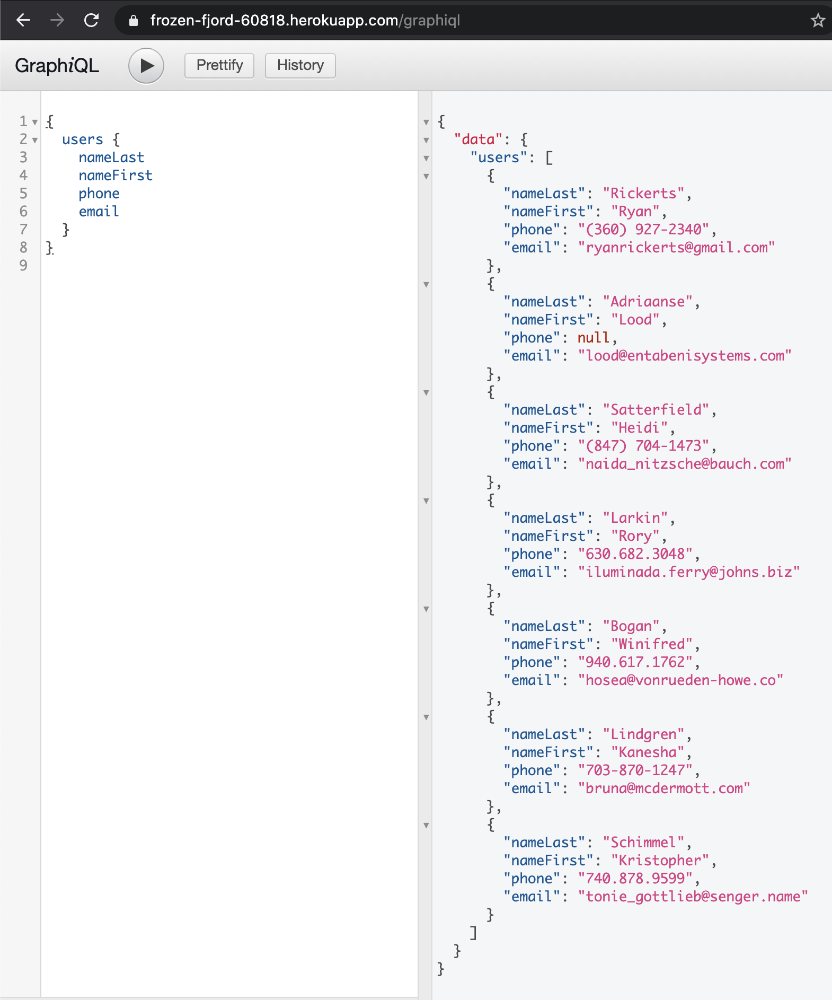
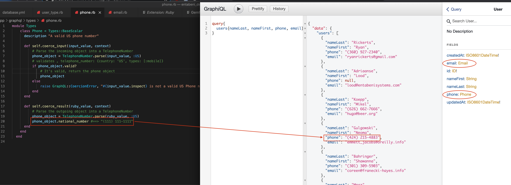
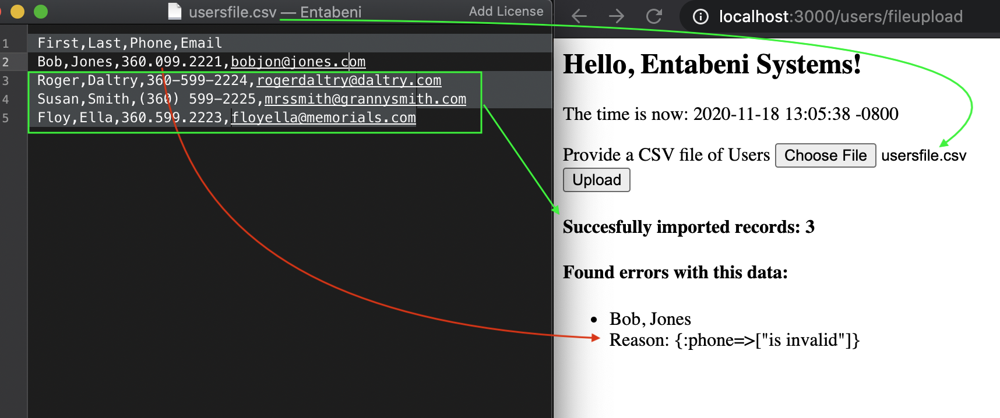
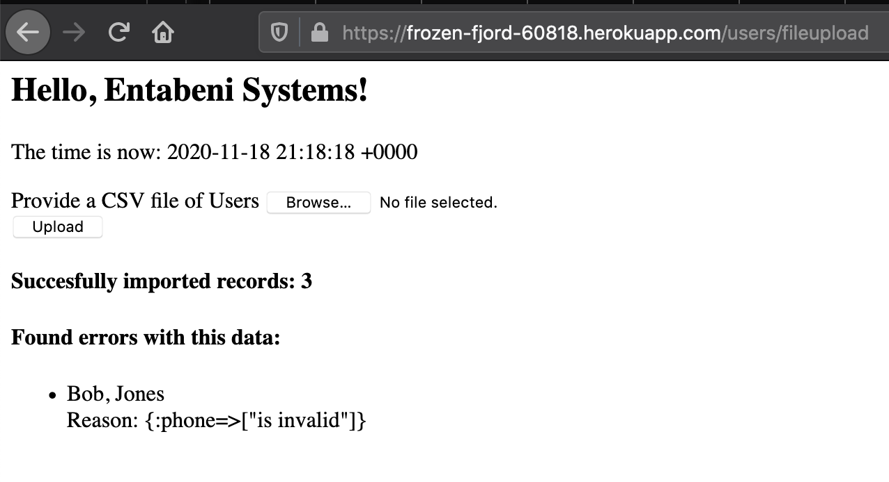
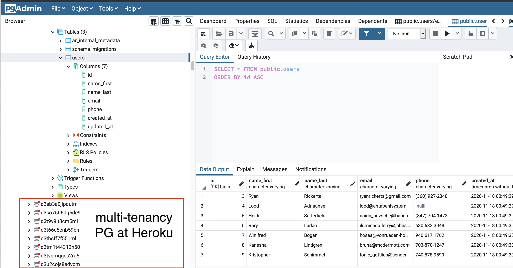
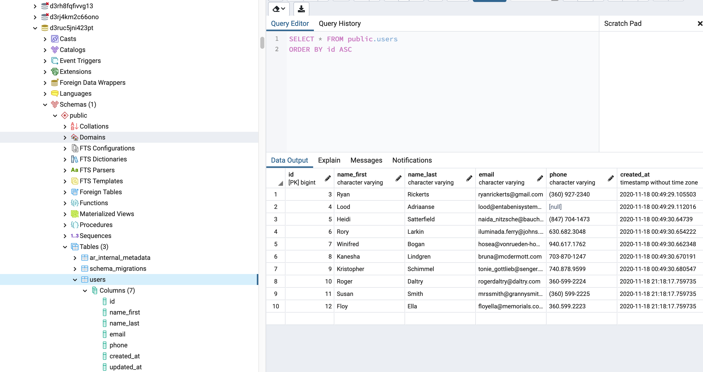

# README

This README documents the steps necessary to get the
application up and running, or visit the demo on Heroku:

[frozen-fjord-60818.herokuapp.com](https://frozen-fjord-60818.herokuapp.com/)

[Live GraphiQL Editor](https://frozen-fjord-60818.herokuapp.com/graphiql/)

* __Ruby version:__ 2.6.6 (I use [rbenv](https://github.com/rbenv/rbenv))
* __Rails version:__ 6.0.3 

* __System dependencies:__ PostgreSQL (brew install postgresql)

* __Configuration:__
bundle install && yarn install

* __Local database creation:__
PostgreSQL create `entabeni_demo` with user and password created
Same creds added to development environment using Rails 6 [custom credentials](https://github.com/rails/rails/pull/33521).
Edited with `rails credentials:edit --environment development`
```
postgres:
  user: yourname
  password: supersecret
```
__Note__: There is an issue deploying on Heroku with this new Rails 6 syntax (for environment-specific encrypted credentials) in the `database.yml` file, so it is removed prior to deployment:
```
  username: <%= Rails.application.credentials.postgres[:user] %>
  password: <%= Rails.application.credentials.postgres[:password] %>
```
* __Local database initialization:__
```
rails db:create db:migrate db:seed
```

* __How to run the test suite:__
bundle exec rspec

* __Deployment instructions:__ 
modify `main` branch
push to remote `heroku`
(uses puma via `Procfile`)

* __Create Users with CSV file__
upload button available at home page (root of app)
format expected (in any order) with valid US phones and emails: 
```
First,Last,Phone,Email
Bob,Jones,360.599.2221,bobjones@jones.com
Roger,Daltry,360-599-2224,rogerdaltry@daltry.com
Susan,Smith,(360) 599-2225,mrssmith@grannysmith.com
Floy,Ella,360.599.2223,floyella@memorials.com
```
* __Screenshots of working demo__:

GraphiQL query of all Users on Heroku ([try yourself](https://frozen-fjord-60818.herokuapp.com/graphiql)):<br/>


Showing the GraphQL custom scalar that formats phones on Query result:<br?>


Imported CSV segregating data (using ActiveRecord validation) and returning errors to user:


Same result on Heroku ([try yourself](https://frozen-fjord-60818.herokuapp.com)):<br/>


After db:seed on Heroku Postgres instance (Lood asked if I had dealt with multi-tenancy. The better answer is yes, as a client, not the host):<br/>


The result of imported data (3 valid records from example at bottom) combined with seed data on Heroku Postgres instance:<br/>



